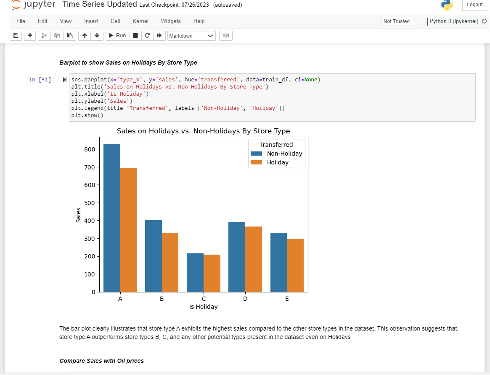

# Time Series ML Project 📈

Welcome to the **Time Series ML Project**, where we dive into time series forecasting while adhering to the CRISP-DM framework. Our mission is to predict store sales using data from Corporation Favorita, a major grocery retailer in Ecuador. We aim to develop a model that provides precise predictions for the unit sales of various items sold across different Favorita stores.


## 🔍 Preview

Below is a preview showcasing the app's appearance.

<div style="display: flex; align-items: center;">
    <div style="flex: 33.33%; text-align: center;">
        <p>Top</p>
        
    </div>
    <div style="flex: 33.33%; text-align: center;">
        <p>Middle</p>
        
    </div>
    <div style="flex: 33.33%; text-align: center;">
        <p>Bottom</p>
        
    </div>
</div>

## Project Overview 📊

The project spans the task of time series forecasting in the context of store sales. Our journey unfolds as an exciting exploration through these milestones:

### 1. 📥 Data Collection

**Data Sources:**

- SQL Server database (table1, table2, table3)
- CSV files from designated zip files
- Excel file from OneDrive

### 1. 📥 Data Collection

Collecting data from various sources:

- SQL Server database
- CSV files
- Excel files from OneDrive

### 2. 📚 Data Loading

Loading and merging collected data:

- Utilizing `pyodbc` for SQL data
- Leveraging `pandas` for CSV and Excel files

### 3. 🧐 Data Evaluation (EDA)

Exploring and analyzing data:

- Summarization
- Duplicate checks
- Handling missing values
- Visual analysis using SARIMA and ADF tests

### 4. 🧹 Data Processing and Engineering

Data preprocessing:

- Managing missing values
- Transforming categorical variables
- Potentially creating new features

### 5. 🧪 Hypothesis Testing

Formulating and testing hypotheses:

- Statistical methods with `scipy`
- Chi-Square Test of Independence
- t-test

### 6. 📈 Answering Questions with Visualizations

Visualizing time series insights:

- Creating plots and charts
- `matplotlib` and `seaborn` libraries

### 7. 🌟 Power BI Deployment

Interactive exploration and sharing:

- Interact with the Dashboard here [Power BI](https://app.powerbi.com/reportEmbed?reportId=99b47ffa-359a-482b-aea4-019c87a73cda&autoAuth=true&ctid=4487b52f-f118-4830-b49d-3c298cb71075)
- Discover Python integration with Power BI [here](https://learn.microsoft.com/en-us/power-bi/connect-data/desktop-python-visuals)


### 8. ⚙️ Model Training and Evaluation

Training and assessing machine learning models:

- ARIMA, SARIMA, XGBoost Regressor, CatBoost Regressor
- Using MAE, RMSE, RMLSE metrics

### 9. 📊 Model Evaluation

Evaluating and fine-tuning the chosen model:

- Generating confusion matrices

### 10. ⚙️ Advanced Model Improvement

Hyperparameter tuning:

- GridSearchCV for selected models

### 11. 🔮 Future Predictions

Predicting future events or trends:

- Business forecasting
- Proactive measures based on time-dependent outcomes

## Installation and Setup 🔧

To get started with this project, you'll need to install the following Python packages using `pip`:

```bash
pip install pyodbc sqlalchemy lightgbm catboost python-dotenv pandas numpy matplotlib seaborn scipy pmdarima
```

Make sure to have these packages installed before running the project.
Follow these steps for installation:

1. Clone this repository to your local machine.
2. Install the required Python packages using pip:
   ```bash
   pip install -r requirements.txt
   ```

You're now ready to dive into this exciting data journey with us!

## Author 👨‍💼

| Name                | Article Link                                                                                                                                                                                                                               | Github |
| ------------------- | ------------------------------------------------------------------------------------------------------------------------------------------------------------------------------------------------------------------------------------------ | ------ |
| Israel Anaba Ayamga | [Revolutionizing Retail: Unleashing the Power of Time Series Forecasting to Optimize Store Sales](https://israelanaba.medium.com/revolutionizing-retail-unleashing-the-power-of-time-series-forecasting-to-optimize-store-sales-91104347f644) |        |
|                     |                                                                                                                                                                                                                                            |        |

## Acknowledgments 🙏

I would like to express my gratitude to the [Azubi Africa Data Analyst Program](https://www.azubiafrica.org/data-analytics) for their support and for offering valuable projects as part of this program. Not forgeting my scrum masters on this project [Rachel Appiah-Kubi](https://www.linkedin.com/in/racheal-appiah-kubi/) & [Emmanuel Koupoh](https://github.com/eaedk)

## License 📜

This project is licensed under the MIT License - see the [LICENSE.md](LICENSE.md) file for details.

## 📧 Contact

For questions or feedback, please contact [Israel Anaba Ayamga](officicalanaba@gmail.com).
